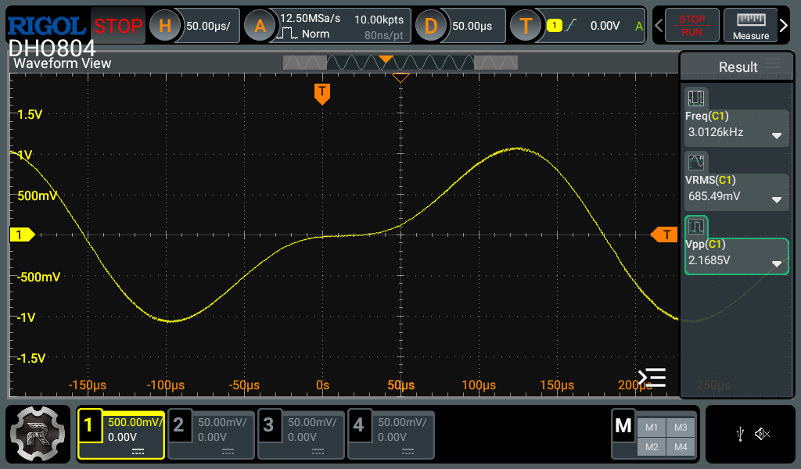
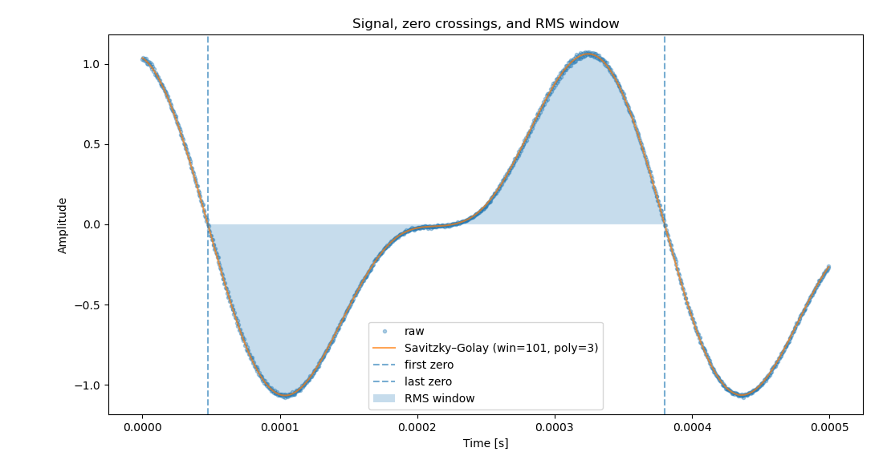
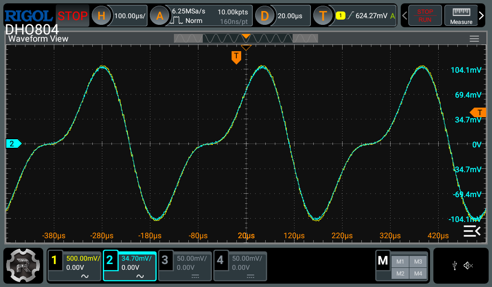

# Robomow Signal Generator (ESP32)

## 📖 Overview
**Robomow RX and RT series** robot lawnmowers often show up secondhand for very cheap, but they are often missing the base station that generates the boundary wire signal. Buying original replacement parts for these entry-level models is unfortunately not cost-effective.
This project documents how I reverse engineered the boundary wire signal to build my own base station using an ESP32 and an LM386 audio amplifier.  

I found these same mowers also sold under other brands:

- Robomow RX → also sold as **Wolf Garten Loopo S** and **Cub Cadet XR1**
- Robomow RT → also sold as **Black & Decker BCMW123**  

These models are simple badge-engineered versions with different colors and covers, but internally they are identical. This project applies to all of them.

If you find this project useful and want to support more reverse-engineering of these great little mowers, you can [buy me a coffee](https://www.buymeacoffee.com/eelcogg). ☕

---

## 🔍 Motivation
I kept noticing used Robomow mowers for sale on my local marketplace. They were often sold for next to nothing when only needing minor repairs, but nearly all of them were missing the base station that generates the boundary wire signal. These mowers need a boundary wire to nagivate the yard and find their way back to the base station for charging, so without the wire signal generator, the mower is useless.

When I looked into buying replacements, the prices were shocking. A charging head costs around €150, a simple wheel motor €125, and a main board €175. That is more than half the cost of a brand new mower. For the entry-level RX and RT models, it just isn’t economical to buy OEM parts.

That felt wasteful to me. These are solid little machines, and I enjoy fixing things instead of seeing them scrapped. So I connected an oscilloscope to a working system, captured the boundary wire signal, and decided to try reproducing it with hardware I already had on hand.  

Using the ESP32’s DAC output and a simple LM386 amplifier, I managed to inject the signal into the boundary wire. To my surprise, the mower followed the wire perfectly. Even better, by flipping the signal in software, I could create “keep-out” zones inside the mowing area. That was the breakthrough moment when I realized I had a practical, affordable way to bring these abandoned mowers back to life.  

---
## 🔬 Reverse Engineering
To understand how the original Robomow base station worked, I connected a **5 Ω dummy resistor** across the output terminals. With my oscilloscope across the resistor, I observed the following:  

- Signal frequency: a little over **3 kHz**  
- Amplitude: about **2 Vpp**

Changing the dummy resistor to 10 Ω doubled the amplitude. This means the generator is probably trying to push a constant current through the loop. This makes sense because loop current determines the magnetic field strength.

I think we can conclude that the base station is trying to push **150–200 mArms** through the boundary wire loop.

Here is the original Robomow boundary signal for the 5 Ω dummy resistor:

### Signal Processing
Once I captured the waveform, I exported it from the oscilloscope as a **CSV file**. Using a Python script, I:  
1. Detected exactly one period between zero-crossings  
2. Smoothed the waveform with a **Savitzky–Golay filter**  
3. Calculated the RMS value for verification  
4. Plotted the cleaned signal  

There is some frequency variation from the original generator. I averaged the frequency to 3007.4825Hz.
Here is the processed waveform:  

### Preparing for the ESP32 DAC
To make the signal suitable for the ESP32 DAC, I:  
- Scaled the waveform between **0 and 255**  
- Took **1024 samples** over exactly one period  
- Stored the samples in a **byte array** (`waveform.h`)  

The ESP32 then continuously outputs this array through its DAC, amplified by the LM386, to recreate the boundary wire signal.  

Here is the recreated signal on channel 1, overlaid on the original signal on channel 2. As you can see **it's a perfect match!**  

## 🛠️ Hardware
- ESP32 development board  
- LM386 audio amplifier module (cheap, widely available)  
- ~7 Ω resistor in series with the boundary wire loop (keeps the LM386 happy with its output impedance)  
- Boundary wire loop (standard garden robot setup)

## ✅ Testing & Results
For testing, I laid out a temporary loop of wire about 1.5 meters in diameter, secured to the ground with pegs. The ends of the loop were connected to the LM386 amplifier, and I adjusted the volume until I measured roughly **125 mArms** of loop current.

Then came the fun part: I placed my trusty **Robomow RT300** inside the loop and pressed the *Go Home* button.  

**It worked! 🎉**  
The mower immediately started following the wire, circling endlessly since there was no base station to stop it. Even better, it would also happily mow the patch of grass contained inside this small loop, proving that the signal was strong and stable enough for real mowing.  

Flipping the polarity of the wire connection turned the loop into a **keep-out zone** instead of a mowing area. This feature will be very useful for creating temporary boundaries, for example to protect newly seeded patches of grass or sensitive areas in the garden. 

Here’s a short video of the RT300 driving around the test loop:

## 💻 Software
The ESP32 code reproduces the waveform using its onboard DAC. It's now set for continuous output. Once combined with the mower battery charger, I will implement On-Off. 
Parts of this project’s code were written with the help of ChatGPT.  
I am not a professional programmer, so the implementation may not be perfect.  
I welcome contributions from more experienced developers to improve efficiency, structure, and functionality.  
Source code lives in [`/src`](src/). 

This project was developed with the following setup:

- Arduino IDE **2.3.6**  
- ESP32 Board Library **3.3.0** (by Espressif Systems)  

---

## 🌱 Where this is going
Right now this project is only a signal generator, but the real goal is to **combine it with a charger** so the system behaves like an original base station:  

- When the mower is out mowing → boundary signal is active  
- When the mower returns to charge → boundary signal switches off, charging voltage switches on  
- When it’s time to mow again → boundary signal switches back on, charger switches off  

This approach saves power and reduces unnecessary EMI, since the boundary signal doesn’t need to radiate 24/7.  

The RX and RT models are fairly “dumb” compared to Robomow’s high-end mowers. They don’t have extended smart features (except for setting the mowing schedule via Bluetooth on some versions). I am currently building a **Wi-Fi module** so these mowers can be integrated into **Home Assistant**. That project will live in another repository, stay tuned.  

---

## 🤝 Contributing and Support
Pull requests are very welcome.  
If you want to improve the code, add features, adapt it on other mowers,... go for it.  

Feel free to fork or copy the whole project if it is useful to you. All I ask is a bit of recognition and some [coffee](https://www.buymeacoffee.com/eelcogg).  

---

## ⚠️ Disclaimer
This is a hobby project. It is not affiliated with, endorsed by, or supported by Robomow, Wolf Garten, or Black & Decker.  
Use at your own risk. Not suitable for commercial or safety-critical use.  

---

## 📜 License
MIT License – do whatever you like, just give credit and do not blame me if your mower goes rogue.  

